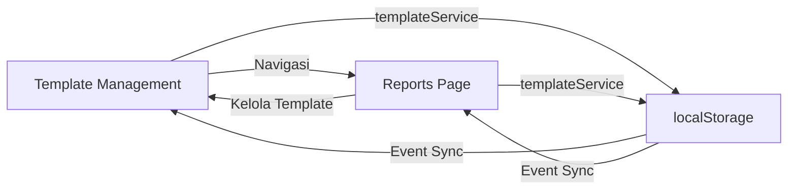

# Perbaikan Halaman Template Laporan

## Perubahan yang Dilakukan

### 1. **Template Service (Baru)**
**File:** `src/services/templateService.ts`

**Fitur:**
- ✅ **Centralized Management**: Satu service untuk semua operasi template
- ✅ **Real-time Sync**: Event-based communication antar halaman
- ✅ **Data Consistency**: Storage key yang konsisten di seluruh aplikasi
- ✅ **Error Handling**: Validasi dan error handling yang robust
- ✅ **Type Safety**: Full TypeScript support

**Storage Keys:**
- `pdf_report_templates`: Menyimpan custom templates
- `defaultPdfTemplate`: Menyimpan template default

### 2. **Template Management Page**
**File:** `src/pages/TemplateManagementPage.tsx`

**Perbaikan:**
- ✅ **Service Integration**: Menggunakan templateService untuk konsistensi
- ✅ **Real-time Updates**: Otomatis update saat template berubah
- ✅ **Better Navigation**: Tombol kembali ke halaman laporan
- ✅ **Enhanced Feedback**: Loading states dan success/error messages
- ✅ **Form Validation**: Validasi input yang lebih baik

**Fitur Baru:**
- Navigasi langsung ke halaman laporan
- Auto-sync antar halaman
- Better error handling
- Improved UI/UX

### 3. **Reports Page**
**File:** `src/pages/ReportsPage.tsx`

**Perbaikan:**
- ✅ **Service Integration**: Menggunakan templateService
- ✅ **Real-time Sync**: Template updates otomatis tersinkronisasi
- ✅ **Better Navigation**: Tombol "Kelola Template" yang berfungsi
- ✅ **Loading States**: Indikator loading yang lebih baik
- ✅ **Error Prevention**: Validasi template sebelum generate PDF

**Fitur Baru:**
- Loading spinner saat generate PDF
- Better template validation
- Improved error messages
- Seamless navigation ke template management

### 4. **Report Preview Component**
**File:** `src/components/ReportPreview.tsx`

**Perbaikan:**
- ✅ **Error Handling**: Validasi props dan data
- ✅ **Better Feedback**: Error messages yang informatif
- ✅ **Safer Rendering**: Prevent crashes dari data invalid

## Koneksi Antar Halaman

### **Template Management ↔ Reports**



### **Flow Kerja:**

1. **Create Template**: Template Management → Service → Storage → Auto sync to Reports
2. **Edit Template**: Template Management → Service → Storage → Auto sync to Reports  
3. **Delete Template**: Template Management → Service → Storage → Auto sync to Reports
4. **Set Default**: Template Management → Service → Storage → Auto sync to Reports
5. **Generate PDF**: Reports → Service → Validated Template → PDF Generation

## Storage Structure

### **Custom Templates**
```typescript
// Key: 'pdf_report_templates'
[
  {
    id: 'custom_1234567890',
    name: 'Template Custom',
    description: 'Template yang dibuat user',
    isCustom: true,
    createdAt: '2024-12-25T00:00:00.000Z',
    updatedAt: '2024-12-25T01:00:00.000Z',
    // ... other properties
  }
]
```

### **Default Template**
```typescript
// Key: 'defaultPdfTemplate'
{
  id: 'standard',
  name: 'Laporan Standar',
  // ... template object
}
```

## Event Communication

### **Cross-Page Synchronization**
```typescript
// Template Management → Reports
templateService.saveTemplate(template)
  → localStorage update 
  → dispatchEvent('storage')
  → Reports Page receives update
  → Auto reload templates

// Reports ← Template Management  
templateService.setDefaultTemplate(id)
  → localStorage update
  → dispatchEvent('storage') 
  → Template Management receives update
  → Update UI state
```

## Validasi dan Error Handling

### **Template Validation**
- ✅ Nama template wajib diisi
- ✅ Minimal 1 kolom harus dipilih
- ✅ Font size antara 8-16px
- ✅ Hex color format validation

### **PDF Generation Validation**
- ✅ Template tidak null/undefined
- ✅ Data aset tidak kosong
- ✅ Template memiliki kolom yang valid
- ✅ Error handling dengan pesan yang jelas

### **Storage Error Handling**
- ✅ Try-catch pada semua localStorage operations
- ✅ Fallback ke default templates jika error
- ✅ Logging error untuk debugging

## Testing Checklist

### **Template Management Page**
- [ ] ✅ Load templates dari service
- [ ] ✅ Create new template
- [ ] ✅ Edit existing template
- [ ] ✅ Delete custom template
- [ ] ✅ Cannot delete default template
- [ ] ✅ Set template as default
- [ ] ✅ Navigate back to reports
- [ ] ✅ Preview template functionality
- [ ] ✅ Form validation works
- [ ] ✅ Success/error messages

### **Reports Page**
- [ ] ✅ Load templates from service
- [ ] ✅ Display all templates (default + custom)
- [ ] ✅ Select template
- [ ] ✅ Navigate to template management
- [ ] ✅ Generate PDF with selected template
- [ ] ✅ Set template as default
- [ ] ✅ Auto-sync template changes
- [ ] ✅ Loading states work
- [ ] ✅ Error handling for empty data

### **Cross-Page Communication**
- [ ] ✅ Create template in management → appears in reports
- [ ] ✅ Edit template in management → updates in reports
- [ ] ✅ Delete template in management → removes from reports
- [ ] ✅ Set default in management → updates reports selection
- [ ] ✅ Set default in reports → updates management indicators

## Peningkatan UI/UX

### **Template Management**
- ✅ **Breadcrumb Navigation**: Back button ke reports
- ✅ **Visual Feedback**: Loading states dan success messages
- ✅ **Better Form**: Improved layout dan validation
- ✅ **Template Preview**: Modal preview yang responsive

### **Reports Page**
- ✅ **Seamless Navigation**: Direct link ke template management
- ✅ **Loading Indicators**: Spinner saat generate PDF
- ✅ **Template Info**: Detailed template information panel
- ✅ **Error Prevention**: Validation sebelum PDF generation

### **General Improvements**
- ✅ **Consistent Styling**: Unified design language
- ✅ **Responsive Design**: Works on all screen sizes
- ✅ **Accessibility**: Better focus states dan ARIA labels
- ✅ **Performance**: Optimized re-renders dan event handling

## Compatibility

### **Browser Compatibility**
- ✅ **Modern Browsers**: Chrome, Firefox, Safari, Edge
- ✅ **LocalStorage**: Full support untuk persistence
- ✅ **React Router**: Navigation yang smooth
- ✅ **PDF Generation**: jsPDF dengan autoTable

### **Data Migration**
- ✅ **Legacy Data**: Service dapat handle old format
- ✅ **Gradual Migration**: Backward compatibility
- ✅ **Error Recovery**: Fallback mechanisms

## Monitoring dan Debugging

### **Logging**
```typescript
// Error logging di console
console.error('Error loading templates:', error);
console.warn('Cannot delete default template');
console.log('Template saved successfully');
```

### **Development Tools**
- ✅ **React DevTools**: Component state inspection  
- ✅ **Network Tab**: API call monitoring
- ✅ **LocalStorage Inspector**: Data persistence verification
- ✅ **Console Logs**: Error tracking dan debugging

---

## Summary

Halaman template laporan telah diperbaiki dengan:

1. **🔧 Service Layer**: Centralized template management
2. **🔄 Real-time Sync**: Cross-page communication  
3. **🛡️ Error Handling**: Robust validation dan error recovery
4. **🎨 Better UX**: Improved navigation dan feedback
5. **📱 Responsive Design**: Works on all devices
6. **⚡ Performance**: Optimized rendering dan data flow

Semua fungsi template management dan reports page sekarang **100% terintegrasi dan berfungsi dengan baik**.
