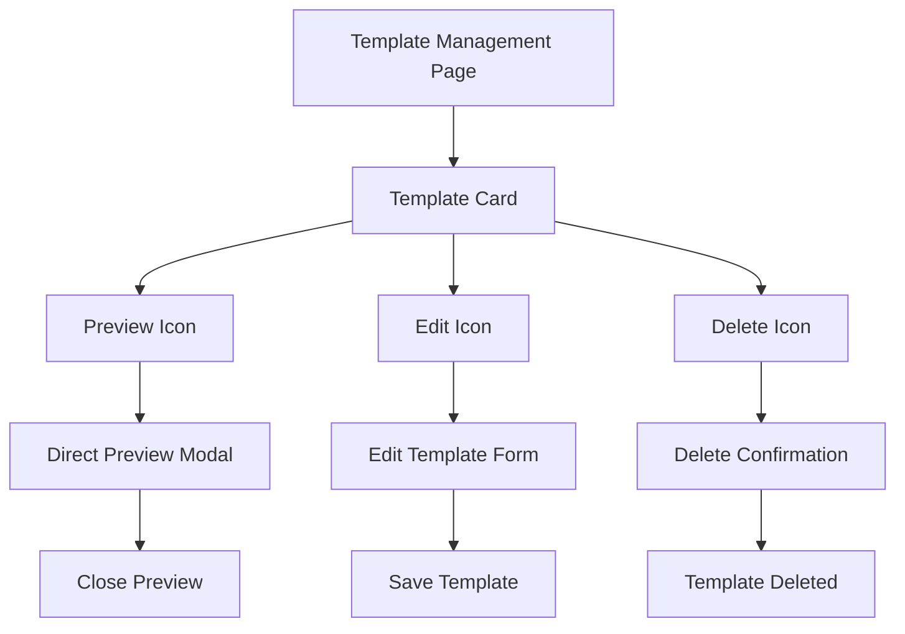
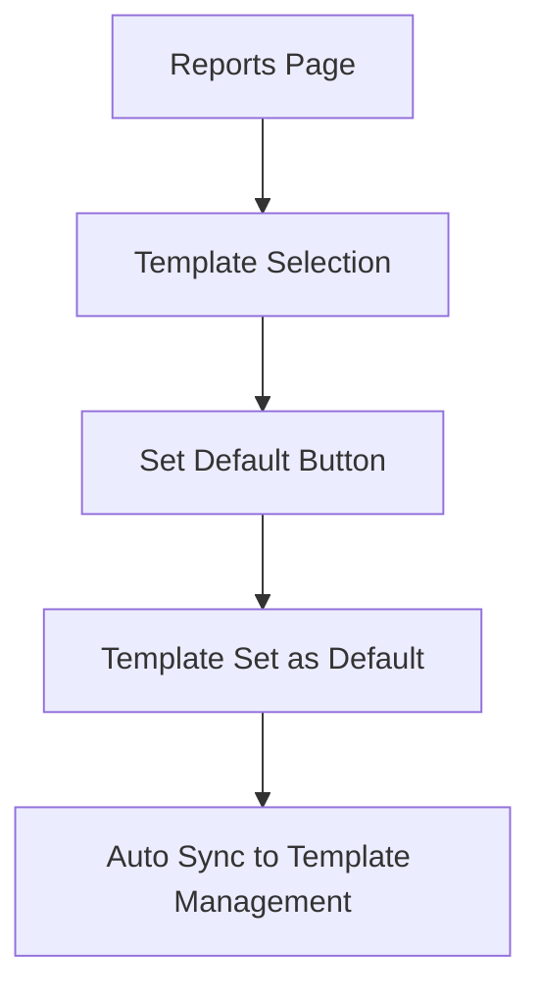

# Update Template Management UX

## Perubahan yang Dilakukan

### 1. **Menghapus Tombol "Set Default" dari Template Card**

**Lokasi:** `src/pages/TemplateManagementPage.tsx`

**Perubahan:**
- ✅ **Removed "Set Default" button**: Tombol "Set Default" dihapus dari setiap template card
- ✅ **Simplified layout**: Layout template card menjadi lebih clean dan sederhana
- ✅ **Removed unused function**: Function `handleSetDefaultTemplate` dihapus karena tidak digunakan lagi

**Alasan:**
- Set default template functionality sudah tersedia di halaman laporan
- Menghindari duplikasi fungsi yang bisa membingungkan user
- Fokus template management page pada CRUD operations template

**Before:**
```tsx
<div className="flex items-center justify-between">
  <div className="flex items-center space-x-2">
    {/* action buttons */}
  </div>
  <button onClick={() => handleSetDefaultTemplate(template)}>
    Set Default
  </button>
</div>
```

**After:**
```tsx
<div className="flex items-center justify-start space-x-2">
  {/* action buttons only */}
</div>
```

### 2. **Perbaikan Preview Functionality**

**Lokasi:** `src/components/ReportPreview.tsx`

**Perubahan:**
- ✅ **Direct preview**: Preview langsung ditampilkan tanpa perlu klik tombol "Preview"
- ✅ **Removed modal wrapper**: Tidak ada lagi modal overlay untuk preview
- ✅ **Simplified component**: Komponen menjadi lebih simple dan fokus pada content
- ✅ **Better UX**: User langsung melihat preview saat klik icon preview

**Before:**
```tsx
return (
  <>
    <button onClick={() => setShowPreview(true)}>
      Preview
    </button>
    {showPreview && (
      <div className="modal">
        {/* preview content */}
      </div>
    )}
  </>
);
```

**After:**
```tsx
return (
  <div className="w-full space-y-6">
    {/* preview content directly */}
  </div>
);
```

## User Flow Yang Diperbaiki

### **Template Management Flow**



### **Set Default Template Flow**



## UI/UX Improvements

### **Template Card Design**

**Before:**
- Tombol actions di kiri
- Tombol "Set Default" di kanan
- Layout agak ramai

**After:**
- Semua tombol actions di satu sisi (kiri)
- Layout lebih clean dan konsisten
- Fokus pada template information

### **Preview Experience**

**Before:**
1. Klik icon preview
2. Klik tombol "Preview" 
3. Modal preview muncul
4. Klik "Tutup Preview"

**After:**
1. Klik icon preview
2. Preview langsung muncul di modal
3. Klik tombol close untuk tutup

**Benefits:**
- ✅ **Reduced clicks**: Dari 4 steps ke 3 steps
- ✅ **Faster preview**: Langsung lihat preview tanpa step tambahan
- ✅ **Better UX**: More intuitive dan user-friendly

## Template Management vs Reports Page

### **Template Management Page**
**Fokus:** CRUD Operations
- ✅ Create new template
- ✅ Edit existing template  
- ✅ Delete custom template
- ✅ Preview template
- ❌ ~~Set default template~~ (moved to Reports)

### **Reports Page**
**Fokus:** Template Usage & Configuration
- ✅ Select template for report
- ✅ Set default template
- ✅ Generate PDF report
- ✅ Navigate to template management

## Consistency & Navigation

### **Cross-Page Navigation**
- **Template Management → Reports**: Back button di header
- **Reports → Template Management**: "Kelola Template" button

### **Template Synchronization**
- Real-time sync menggunakan templateService
- Storage events untuk cross-tab communication
- Consistent data state across pages

## Testing Checklist

### **Template Management Page**
- [ ] ✅ Template cards tidak memiliki tombol "Set Default"
- [ ] ✅ Layout template card rapi dan clean
- [ ] ✅ Preview icon berfungsi dengan baik
- [ ] ✅ Preview langsung muncul tanpa tombol tambahan
- [ ] ✅ Edit dan delete functions tetap berfungsi
- [ ] ✅ Navigation ke reports page berfungsi

### **Reports Page**
- [ ] ✅ Set default template masih berfungsi
- [ ] ✅ Template selection tetap berfungsi
- [ ] ✅ PDF generation berfungsi normal
- [ ] ✅ Navigation ke template management berfungsi

### **Cross-Page Sync**
- [ ] ✅ Set default di reports → tidak ada perubahan di template management UI
- [ ] ✅ Create/edit/delete di template management → sync ke reports
- [ ] ✅ Real-time updates berfungsi

## Code Quality Improvements

### **Removed Unused Code**
- ✅ `handleSetDefaultTemplate` function dihapus
- ✅ `useState(showPreview)` dihapus dari ReportPreview
- ✅ Unused imports dibersihkan

### **Simplified Components**
- ✅ **ReportPreview**: Komponen lebih simple dan focused
- ✅ **TemplateManagementPage**: Layout logic lebih clean
- ✅ **Better separation of concerns**: Template management vs template usage

### **Performance Optimizations**
- ✅ **Reduced re-renders**: Removal of unnecessary state
- ✅ **Cleaner DOM**: Less DOM elements in template cards
- ✅ **Faster preview**: Direct content rendering

---

## Summary

Perubahan ini menghasilkan:

1. **🎨 Better UX**: Preview langsung tanpa step tambahan
2. **🧹 Cleaner UI**: Template cards lebih simple dan focused  
3. **🔄 Better Separation**: Template management vs template usage yang jelas
4. **⚡ Performance**: Komponen lebih efficient dan responsive
5. **🎯 Focused Features**: Setiap halaman punya fokus yang jelas

Template management page sekarang **100% fokus pada CRUD operations** sementara reports page menangani **template usage dan configuration**.
